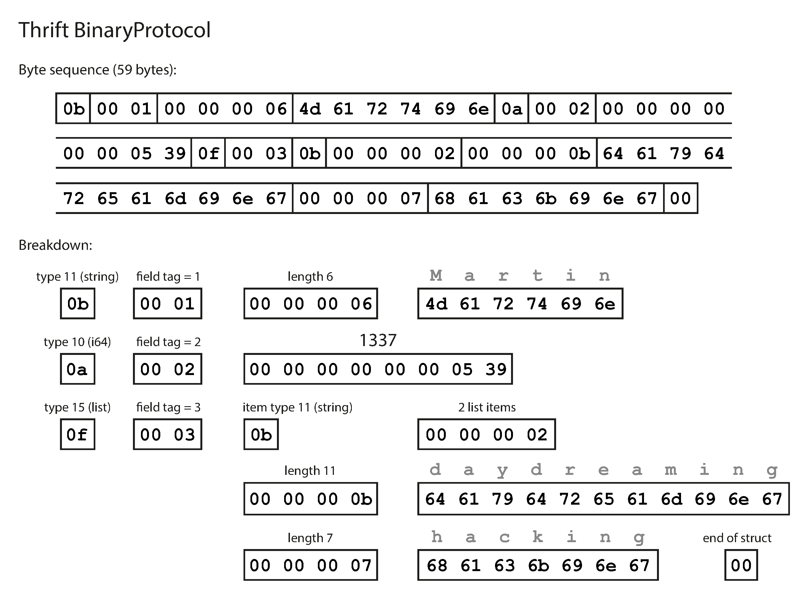
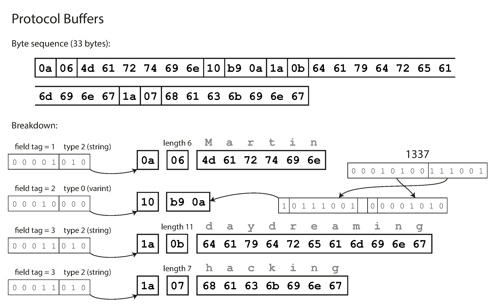
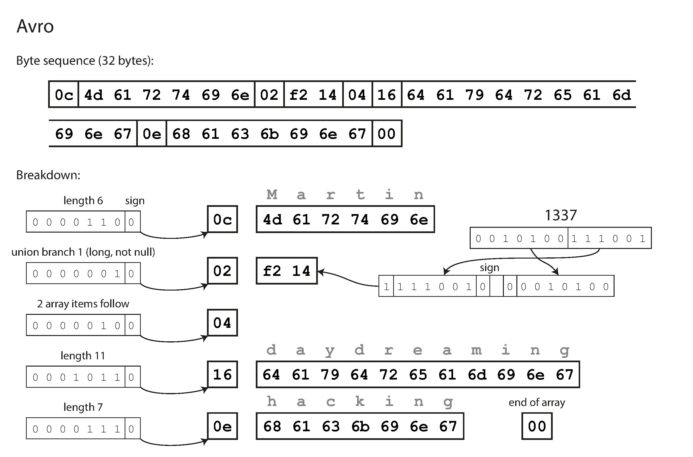

# Lesson

## Brief

### Preparation

Ensure you have a basic understanding of XML and REST API as listed in [studies](./studies.md).

We will be using the `bde` environment for this lesson.

### Lesson Overview

This lesson introduces the various data encoding formats and modes of data flow. You will be able to encode and decode data in various formats and exchange data via RPC.

---

## Part 1 - Data Encoding Formats

Conceptual knowledge, refer to slides.

---

## Part 2 - Hands-on with data encoding, decoding and flow via RPC

We will be using the `notebooks/encoding_flow_lesson.ipynb` notebook throughout this lesson.

> Open the notebook in VSCode by double clicking on the file. Then select `bde` conda environment for the kernel.
>
> Follow on with the lesson in the notebook.

## Apache Thrift

The thrift type system includes base types like _bool, byte, double, string and integer_ but also special types like _binary_ and _struct_ (like classes) and also containers (_list, set, map_) that correspond to commonly available interfaces in most programming languages.

Base types:

- bool: A boolean value (true or false)
- byte: An 8-bit signed integer
- i16: A 16-bit signed integer
- i32: A 32-bit signed integer
- i64: A 64-bit signed integer
- double: A 64-bit floating point number
- string: A text string encoded using UTF-8 encoding

Thrift type definitions are defined in `.thrift` files. The Thrift compiler generates code in various languages from the `.thrift` files.

### Encoding

Let's use the following example record (JSON or dictionary-like) to encode:

```json
{
  "userName": "Martin",
  "favoriteNumber": 1337,
  "interests": ["daydreaming", "hacking"]
}
```

We can encode the record in Thrift using the following schema in the `.thrift` file:

```thrift
struct Person {
  1: required string userName,
  2: optional i64 favoriteNumber,
  3: optional list<string> interests
}
```

Thrift comes with a code generation tool that takes a schema definition like the ones shown here, and produces classes that implement the schema in various programming languages. Our code can call this generated code to encode or decode records of the schema.

The data encoded with this schema looks like this:


Each field has a type annotation (to indicate whether it is a string, integer, list, etc.) and, where required, a length indication (length of a string, number of items in a list). The strings that appear in the data (“Martin”, “daydreaming”, “hacking”) are encoded as UTF-8.

There are no field names (userName, favoriteNumber, interests). Instead, the encoded data contains _field tags_, which are numbers (1, 2, and 3). Those are the numbers that appear in the schema definition. Field tags are like aliases for fields—they are a compact way of saying what field we’re talking about, without having to spell out the field name.

Next, let's add a service. A service is a collection of method interfaces that can be called remotely. A service is defined in a `.thrift` file like this:

```thrift
service School {
    Person teachCourse(1: required Person person, 2: required string course)
}
```

The first line declares a service called `School`. The second line declares a method called `teachCourses`, which takes two arguments: a `Person` record and a `string`. The method returns a `Person` record.

### RPC

Nows, let's look at how to use the generated code to make remote procedure calls. We will write codes for 2 sides of the server-client application- the client initiates an RPC call and waits for a response from the server. The server executes the requested operation and returns a response to the client.

> Add a new field `grade` (0-100) with an appropriate type annotation to the `Person` struct. Then, add a new method `assignGrade` to the `School` service that takes a `Person` record and a `grade` arguments, assigns the `grade` to the `Person` and returns the `Person`. Then call the method by passing `martin` and a grade number, and print his grade.

> Add a method `teachCourses` to School to add a list of courses instead of just one course. Then pass `martin` and a list of course-- `["cooking", "sewing"]` to the method, and print his new interests.

## Protocol Buffers (Protobuf)

Protobuf types include:

- double: double precision floating point number
- float: single precision floating point number
- int32: signed integer, uses variable-length encoding
- int64: signed integer, uses variable-length encoding
- uint32: unsigned integer, uses variable-length encoding
- uint64: unsigned integer, uses variable-length encoding
- sint32: signed integer, uses variable-length encoding, more efficient than int32
- sint64: signed integer, uses variable-length encoding, more efficient than int64
- fixed32: unsigned integer, always 4 bytes
- fixed64: unsigned integer, always 8 bytes
- sfixed32: signed integer, always 4 bytes
- sfixed64: signed integer, always 8 bytes
- bool: boolean value
- string: UTF-8 text string
- bytes: sequence of bytes
- enum: enumerated type
- message: nested message type
- map: map type
- Any: dynamic type

Protobuf schema definitions are defined in `.proto` files. The Protobuf compiler generates code in various languages from the `.proto` files.

### Encoding

We can encode the previous example record in Protobuf using the following schema in the `.proto` file:

```protobuf
message Person {
  required string user_name = 1;
  optional int64 favorite_number = 2;
  repeated string interests = 3;
}
```

The data encoded with this schema looks like this:


Protocol Buffers have an interesting aspect regarding its datatype handling. Unlike having a specific list or array datatype, it utilizes a `repeated` marker for fields, which serves as a third option alongside `required` and `optional`.

As depicted in the figure, a repeated field is simply represented by the same field tag appearing multiple times in the record. The advantage of this approach is that converting an optional (single-valued) field into a repeated (multi-valued) field is permissible. When new code reads old data, it interprets it as a list with either zero or one element, depending on whether the field was present. On the other hand, old code reading new data only perceives the last element of the list.

### gRPC

Nows, let's look at how to use the generated code to make remote procedure calls. We will use gRPC, which is a high-performance RPC framework built on top of Protobuf. gRPC is a client-server application where the client initiates an RPC call and waits for a response from the server. The server executes the requested operation and returns a response to the client.

> Add a new field `grade` (0-100) with an appropriate type annotation to the `Person` message. Then, add a new method `assignGrade` to the `School` service that takes a `GradeRequest` message (which consists of a `Person` record and a `grade` arguments), assigns the `grade` to the `Person` and returns the `Person`. Then call the method by passing "Martin" `person` and a grade number, and print his grade.

## Schema Evolution for Thrift and Protobuf

Let's explore how Thrift and Protocol Buffers manage schema changes to ensure both _backward_ and _forward compatibility_.

From the examples above, an encoded record comprises concatenated encoded fields. Each field is identified by a tag number (e.g., 1, 2, 3 in the sample schemas) and annotated with a datatype (such as string or integer). If a field value is not set, it is simply omitted from the encoded record. It's important to note that field tags play a crucial role in determining the meaning of the encoded data. Although you can modify a field's name in the schema without issues, changing a field's tag would render all existing encoded data invalid.

Adding new fields to the schema is permissible, but it requires assigning each field a new tag number. Old code, which is unaware of the new tag numbers, can still read data written by new code, and if it encounters an unrecognized tag number, it can safely ignore that field. The datatype annotation allows the parser to determine the necessary bytes to skip, thus maintaining _forward compatibility_.

Regarding _backward compatibility_, as long as each field retains a unique tag number, new code can read old data successfully because the tag numbers retain their original meaning. However, when adding a new field, it cannot be made required since old code wouldn't have written this new field, causing compatibility issues. Hence, to ensure backward compatibility, **any fields added after the initial schema deployment must be optional or have default values**.

Removing a field follows a similar principle to adding one, but with backward and forward compatibility concerns reversed. Only optional fields can be removed, never required fields, and once a tag number is removed, it can't be reused to prevent conflicts with existing data written with the old tag number.

Changing the datatype of a field is possible, but it carries the risk of losing precision or truncating values. For instance, converting a 32-bit integer into a 64-bit integer may lead to data loss when old code reads data written by new code, as the old code uses a 32-bit variable to hold the value. If the 64-bit value exceeds the capacity of a 32-bit variable, it will be truncated. Thus, careful consideration is necessary when altering field datatypes, and consulting the documentation is advisable to understand potential implications.

## Apache Avro

Avro has the following types:

- null: no value
- boolean: a binary value
- int: 32-bit signed integer
- long: 64-bit signed integer
- float: single precision (32-bit) IEEE 754 floating-point number
- double: double precision (64-bit) IEEE 754 floating-point number
- bytes: sequence of 8-bit unsigned bytes
- string: Unicode character sequence
- record: ordered collection of named fields
- enum: enumeration of string values
- array: ordered collection of values
- map: collection of key-value pairs
- union: ordered list of values

It has two schema languages: one (`Avro IDL`) intended for human editing, and one (based on JSON) that is more easily machine-readable.

### Encoding

We can encode the previous example record in IDL using the following schema in the `.avsc` file:

```avro
record Person {
  string userName;
  union { null, long } favoriteNumber = null;
  array<string> interests;
}
```

The equivalent JSON representation of that schema is as follows:

```json
{
  "type": "record",
  "name": "Person",
  "fields": [
    { "name": "userName", "type": "string" },
    { "name": "favoriteNumber", "type": ["null", "long"], "default": null },
    { "name": "interests", "type": { "type": "array", "items": "string" } }
  ]
}
```

The data encoded with this schema looks like this:


First and foremost, it's important to note that the schema lacks tag numbers. When we encode our sample record using this schema, the resulting Avro binary encoding is impressively compact, spanning just _32 bytes_—the most space-efficient among all the encodings we've observed.

Examining the byte sequence, one can readily discern the _absence of field identifiers or datatype markers_. The encoding solely comprises concatenated values. For instance, a string is represented by a length prefix followed by UTF-8 bytes, but there are no explicit indicators within the encoded data to specify that it is, indeed, a string. In fact, it could be interpreted as an integer or any other data type altogether. Similarly, an integer is encoded using a variable-length encoding.

To correctly parse the binary data, you must traverse the fields in the order they appear in the schema and _refer to the schema_ itself to ascertain the datatype of each field. Consequently, the binary data can only be accurately decoded if the code reading the data employs the exact same schema as the code that wrote the data. Any deviation or mismatch in the schema between the reader and the writer would result in incorrectly decoded data.

With Avro, data encoding and decoding are based on two schemas: the `writer's schema` used during data encoding and the `reader's schema` employed during data decoding. These schemas do not necessarily have to be identical but should be compatible. When decoding data, the Avro library compares the writer's and reader's schemas, resolving any discrepancies between them.

The Avro specification ensures that fields in different orders between the writer's and reader's schemas pose no issues during resolution since schema matching occurs based on field names. If the reader's schema lacks a field present in the writer's schema, it is simply ignored. Conversely, if the reader's schema expects a field that the writer's schema does not contain, the missing field is filled in with a default value declared in the reader's schema. This allows for flexible schema evolution while maintaining data compatibility.

### Reading (Decoding) a File

Instead of demonstrating RPC, let's look at how to decode data from a file from a real-world dataset. We have a genomic variation data of 1000 samples from the [OpenCGA](http://docs.opencb.org/display/opencga/Welcome+to+OpenCGA) project.

## Apache Parquet, ORC and Arrow

We can easily read (decode) and write (encode) data from and to Parquet, ORC and Arrow files interchangeably. The `pyarrow` library allows us to read a Parquet or ORC file into a `pyarrow.Table` object, which is a columnar data structure that can be converted to a Pandas DataFrame. We can also write a `pyarrow.Table` to a Parquet or ORC file.

Parquet has the following types:

- boolean: 1 bit boolean
- int32: 32 bit signed ints
- int64: 64 bit signed ints
- int96: 96 bit signed ints
- float: IEEE 32-bit floating point values
- double: IEEE 64-bit floating point values
- byte_array: arbitrarily long byte arrays
- fixed_len_byte_array: fixed length byte arrays
- string: UTF-8 encoded strings
- enum: enumeration of strings
- temporal: a logical date type

ORC has the following types:

- boolean: 1 bit boolean
- tinyint: 8 bit signed ints
- smallint: 16 bit signed ints
- int: 32 bit signed ints
- bigint: 64 bit signed ints
- float: IEEE 32-bit floating point values
- double: IEEE 64-bit floating point values
- string: UTF-8 encoded strings
- char: ASCII strings
- varchar: UTF-8 strings
- binary: byte arrays
- timestamp: a logical date type
- date: a logical date type
- decimal: arbitrary precision decimals
- list: an ordered collection of objects
- map: a collection of key-value pairs
- struct: an ordered collection of named fields
- union: a list of types

### Reading (Decoding) and Writing (Encoding) a Parquet File

Let's look at how to decode and encode a Parquet file with mock customers data.

### Reading (Decoding) and Writing (Encoding) an ORC File

Let's look at how to decode and encode an ORC file with mock customers data.
